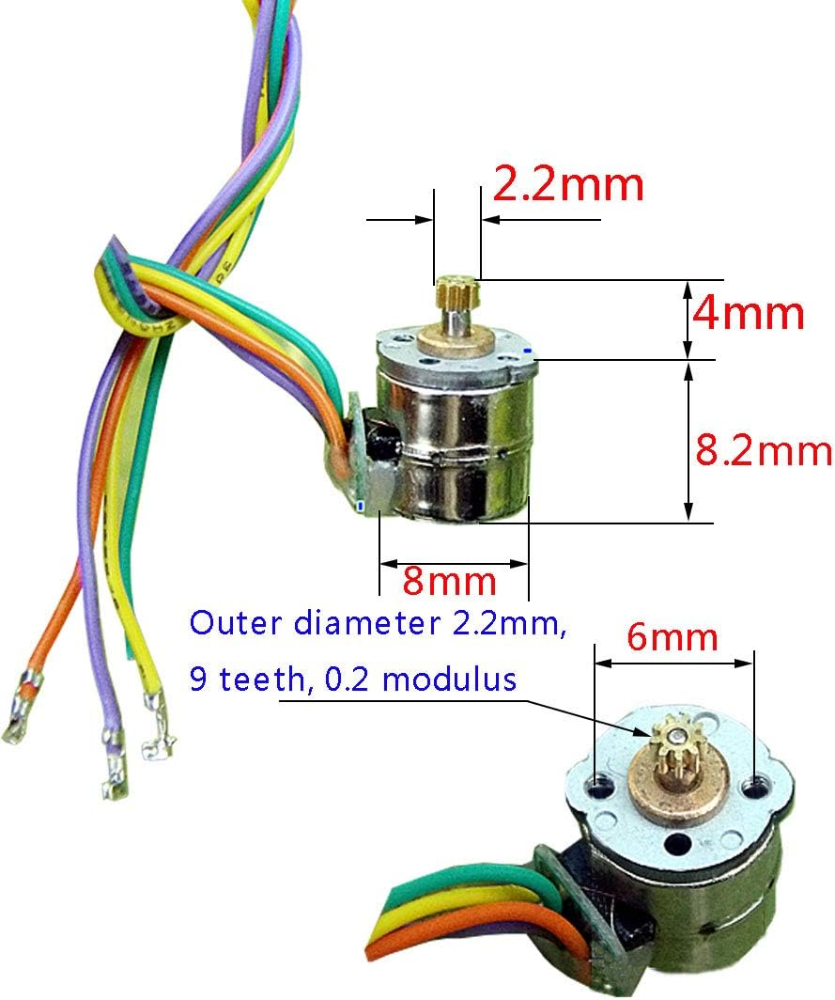

# Legacy test — pneumatic multiplexer

This is a **legacy test** preserved as historical design evidence. It predates
the current suggested testing framework and does not need to be migrated to it.

The experiment explores a SolidPython-based pneumatic multiplexer shape-display
concept and retains its original source, requirements, renders, and local
documentation. Its original language, API, and file layout are intentionally
allowed to remain as-is.

## stepper motor
Generic micro stepper motor from [Aliexpress](https://nl.aliexpress.com/item/4000806393169.html) at €0.52 per pair (see also listing on [Amazon](https://www.amazon.com/Abovehill-Stepper-2-Phase-4-Wire-Connection/dp/B08346RFVZ)).

| specifications | |
|-----|------|
| wiring | two phases, four wires|
| resistance | 40 Ω |
| recommended voltage | 5-6V |
| driving current | 0.12A |
| short-circuit current | 0.14A |
| connection lines 1 | blue: A +, black: A-, red: B+, white: B- |
| connection lines 2 | purple: A +, yellow: B-, orange: B+, green: B- |

(output shaft diameter: 1.5mm)

# stepper motor driver
TMC2208 from [Aliexpress](https://nl.aliexpress.com/item/1005004014058136.html) at €2.04 per piece.

| specifications | |
|-----|------|
| model | MC2208 V1.2 |
| motor voltage range (VM) | 4.75V-36V |
| motor continuous current | 1.4A |
| motor peak current | 2A |
| logic voltage range (VIO) | 3-5V |
| microsteps | 256 |
