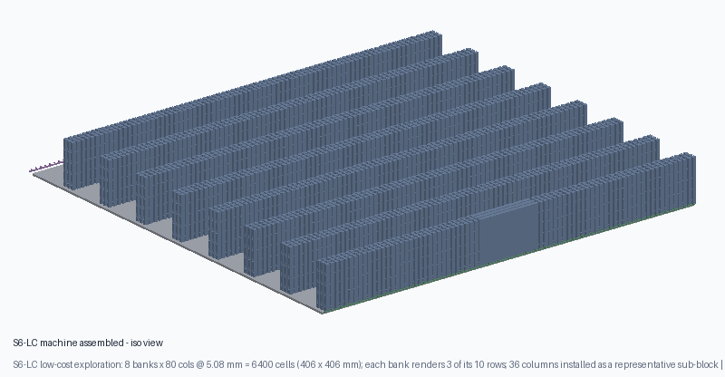
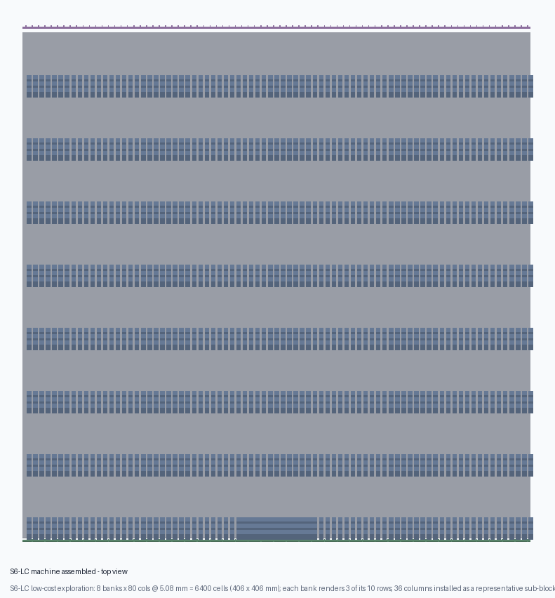
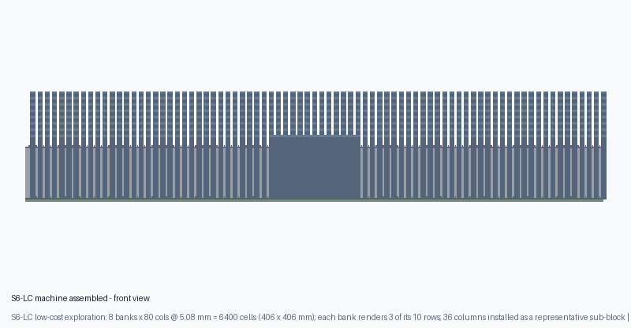
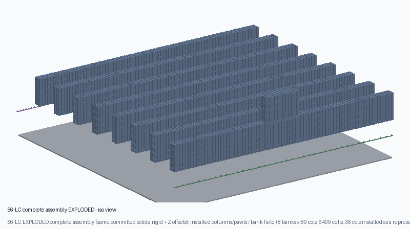
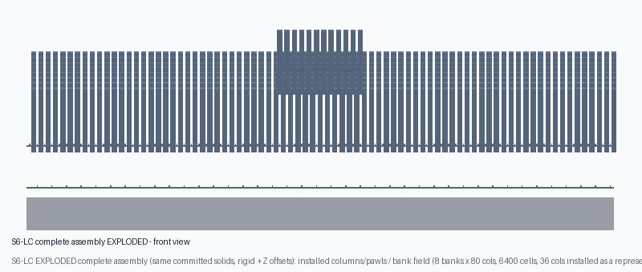

# 09 — Ultra-low-cost alternative: S6-LC

**Status:** **selected candidate machine definition, folded into the DND-72 track — mission gates
pass, per-cell reliability measurement-gated** ([DND-93](/DND/issues/DND-93) + [DND-97](/DND/issues/DND-97)).
**Owner:** CTO. **Issue:** [DND-72](/DND/issues/DND-72) (authoritative synthesis node) /
board direction [DND-70](/DND/issues/DND-70). Originally explored under
[DND-71](/DND/issues/DND-71), consolidated here by CEO direction.
**Fix of record:** [DND-93](/DND/issues/DND-93) (G3 lift-axis) + [DND-97](/DND/issues/DND-97)
(mechanism defects A1/A2/A6/A7/A8). The **mission gate is G5 purchased parts = $226.77 < $250
(PASS)**; the repo's stricter internal delivered convention (G6) is **$263.05** and reported, not
hidden. Verdict **`PROMOTE_TO_09_WITH_MEASUREMENT_GATE`**.
**Base of record:** [`08-current-design/`](../../08-current-design/README.md) (S5-R,
$404.60 delivered — **not modified by this directory**).

> **Evidence class. Everything in this directory is CAD geometry + CALCULATION
> over sourced FDM process limits and sourced actuator ratings. No part has been
> printed, purchased or measured** ([DND-27](/DND/issues/DND-27)). Prices are
> point-in-time sourced-class figures (2026-09). Independent ratification is
> [DND-73](/DND/issues/DND-73); adversarial audit is [DND-91](/DND/issues/DND-91)
> (supersedes [DND-74](/DND/issues/DND-74)); the G3 fix + re-run is
> [`../../07-evidence-and-decisions/dnd93-s6lc-g3-fix.md`](../../07-evidence-and-decisions/dnd93-s6lc-g3-fix.md).
> Synthesis against the S5-R-trim negative result:
> [`../../07-evidence-and-decisions/dnd72-low-cost-synthesis.md`](../../07-evidence-and-decisions/dnd72-low-cost-synthesis.md).

## 1. The target and the honest cost cliff

Board direction [DND-70](/DND/issues/DND-70): **all S5-R requirements stay the
same except the price**, which must be **< $250 purchased, excluding
3D-printed parts**. At the repo's additive delivered uplift (1.16 = +10 % ship
+6 % tax, [DND-41](/DND/issues/DND-41)) that is a **parts ceiling of
$250 / 1.16 = $215.52**.

S5-R's purchased BOM decomposes as:

| Block | USD | Share |
|---|---:|---:|
| Fixed legacy base (S5 lift/scan/frame bought stock) | 218.70 | 62.7 % |
| Actuators: 2 NEMA17 bank motors + 40 writer solenoids | 124.00 | 35.6 % |
| Driver channels + sourced steel rod | 6.09 | 1.7 % |
| **Purchased parts (S5-R)** | **348.79** | 100 % |

**The legacy fixed base alone ($218.70) already exceeds the entire $215.52 parts
budget.** No amount of penny-shaving closes this. The machine must be
re-conceived so that there is **no per-row writer bank** and the bought
lift/scan/frame stock is replaced by a **single-lead-screw axis over a printed
frame**. The cost cliff is **actuator count**, not part quality.

## 2. The machine in one paragraph

**S6-LC** is an 80 × 80 array of **square printed columns** at 5.08 mm pitch
(406.4 × 406.4 mm), each carrying a **five-pocket vertical rack** (10 mm
pockets) and a **printed cantilever pawl** whose armed/disarmed state is a
**DND-76 P1 bistable over-centre latch** — a **hard-stop compression** hold, not
a friction preload (DND-97/A2). Height is stored mechanically — the latch, not
any powered element, holds terrain load. The board is split into **8 banks of 10 rows** (800 cells
each). A full map is written by **four global 10 mm broadcast platen strokes**:
on stroke *k* only the cells whose **bank threshold mask gate** is open advance.
Four binary masks encode five heights (0/10/20/30/40 mm). State is cleared by a
**travelling reset carriage** that trips the eight banked release combs one bank
at a time — which is what bounds the worst-case simultaneous release force.
The only bought actuators are **three steppers**: one **NEMA23-class** lift motor (four
belt-synced lead screws — the global stroke carries all 6,400 cells), one mask-gate index motor,
and one reset-carriage motor. **$226.77 purchased parts / $263.05 delivered**; **11.96 s** full-map.

## 3. Why this machine (design rationale)

| Decision | S5-R | **S6-LC** | Why |
|---|---|---|---|
| Per-cell bought actuator | 0 | **0** | passive printed pawl memory |
| Per-row bought actuator | **40 solenoids** | **0** | a passive mask gate replaces the writer bank |
| Bought actuators total | 42 | **3** | the whole cost lever |
| Lift | printed cam platen + 2 bank motors | **1 stepper, 4 belt-synced screws** | fewer bought parts |
| Selection medium | 40 solenoids over passive rotors | **per-bank punched/printed threshold mask** | $0 actuator |
| Map write | rotating rotor to a hard stop | **4 broadcast 10 mm strokes** | massively parallel |
| Cost (delivered) | $404.60 | **$263.05** (G6 FAIL) | −35 % |
| Full-map time | 24.615 s | **11.96 s** | only 4 strokes, not 80 rows |

The architecture family is the already-screened **S1 broadcast threshold
ratchet** ([`04-architecture-candidates/`](../04-architecture-candidates/README.md),
[Test11 S1/S2 screen](../06-experiments/test11_threshold_ratchet_s1/README.md)).
S1's two open failures were addressed, not ignored:

1. **Worst-case release force** (S1 B2: ~2.4 kN all-armed). Fixed by **banking
   the reset** (S1-B): one bank of 800 cells at a time → **128 N**, 3.2× under
   an independent comb-tooth structural limit (**413 N**; the earlier "296 N
   ceiling" was circular — see [DND-91](/DND/issues/DND-91)/[DND-93](/DND/issues/DND-93)).
2. **Mask write time** (S1 C: serial 2560 s, 80-channel 56 s). Fixed by making
   the mask a **pre-written / off-line medium**, exactly as the S1/S2 screen
   permits. This is stated as a **product limitation**, not hidden (see §6).

## 4. Functional allocation (the ten jobs)

| Job | S6-LC mechanism | Evidence |
|---|---|---|
| Map representation | per-column pawl pocket (5 levels) | CAD + calculation |
| Selection | per-bank threshold mask gate (passive medium) | CAD + calculation |
| Power delivery | one platen, 4 broadcast 10 mm strokes | calculation |
| Vertical positioning | 4 × 10 mm accumulated by one-way pawl | CAD + calculation |
| State retention | pawl in pocket; no powered hold | CAD + calculation |
| Tabletop load support | pawl → rack pocket → column → platen shelf | calculation |
| Lowering / reset | travelling carriage trips 8 banked release combs | CAD + calculation |
| Regional isolation | mask gates are per-bank ⇒ bank-local replay | calculation |
| Programming | set masks off-line; 4 strokes read them | calculation |
| Detection / recovery | axis reference sensors only; no per-cell feedback | assumption |

## 5. Key dimensions and gates

| Parameter | Value | Basis |
|---|---:|---|
| Grid / pitch / cells | 80 × 80 / 5.08 mm / 6,400 | design criteria |
| Column body / owned half-lane | 3.60 mm / **0.74 mm** | DND-97/A1 (owned lane, not the whole gap) |
| Pawl leaf / root | **0.45** × 1.20 × 8.00 mm / 0.90 mm (outboard) | CAD + calculation |
| Travel / level | 40 mm / 10 mm × 4 | design criteria |
| Banks | 8 × 10 rows (800 cells) | calculation (release force) |
| Bought actuators | **3** (NEMA23 lift, mask index, reset carriage) | `s6lc.py` `bom()` |
| Full-map time | **11.96 s** (30 s gate, 18.04 s margin) | `timing()` |
| Purchased parts | **$226.77** (< $250 — **mission gate PASS**) | `bom()` |
| Delivered | **$263.05** (internal convention over) | `bom()` |

### 5a. Gate table (`analysis/s6lc.py` `decide()` — DND-93 + DND-97)

| Gate | Result | Margin |
|---|---|---|
| G1 cell fit (owned half-lane) | **PASS** | leaf 0.45 + 0.20 clear ≤ 0.74 |
| G2 worst-case release force (banked) | **PASS** | 128 N vs 413 N (independent) |
| G3 lift-axis torque (global board) | **PASS** | 1.63 N·m vs 2.2 N·m (1.35×) |
| G4 full map < 30 s | **PASS** | 11.96 s vs 30 s |
| **G5 cost < $250 purchased (mission gate)** | **PASS** | **$226.77** |
| G6 cost < $250 delivered (internal convention) | reported | $263.05 (over $13.05) |
| G7 reset-carriage torque | **PASS** | 0.082 N·m vs 0.16 N·m (1.96×) |
| **G8 per-cell reliability** | **UNRESOLVED** | measurement-only (coupon C1) |

**Corrected verdict: `PROMOTE_TO_09_WITH_MEASUREMENT_GATE`.** All mission gates pass; the
mission cost gate is the **purchased** figure (DND-70), which is **$226.77 < $250**. The internal
delivered convention is $13.05 over and is reported, not hidden. The single measurement-gated item is
**G8 per-cell reliability** (coupon C1). The A1/A2/A6/A7/A8 mechanism defects are repaired by
[DND-97](/DND/issues/DND-97) (pawl leaf section + P1 hold gate, owned-lane fit, reliability gate).

## 6. Product limitation (stated, not hidden)

**Mask preparation is off-line.** S6-LC's visible transition is the four
broadcast strokes + banked reset (11.96 s). The per-bank threshold mask must be
set before the transition. Two legitimate modes:

- **Reused/pre-written media.** Cards or gate combs for common maps are printed
  in advance; an unannounced map needs its gates set first.
- **Off-line set during the previous map.** While the board shows state *n*, the
  operator/controller sets the mask for state *n+1* (double buffering), exactly
  the S2 trade. If the next map is known ~10 s ahead, the <30 s visible target is
  met without qualification.

A genuinely unannounced, arbitrary map is **mask-set-time first**, not 11.96 s.
This is a deliberate, documented limitation of this architecture, recorded
here and in the [DND-71](/DND/issues/DND-71) plan. It is the honest price of
removing the 40-solenoid writer bank.

## 7. Reproduce

```bash
cd 09-low-cost-variant/s6lc/analysis
python s6lc.py             # full machine screen (JSON)
python s6lc_checks.py      # 40 regression checks
python printability_s6lc.py   # sourced FDM-limit table + record
# CAD (real OpenSCAD; see tools/openscad-install/TOOLS)
export PATH="$HOME/.local/bin:$PATH"
python render_s6lc_cad.py  # renders 5 parts, mesh-validates them
python render_s6lc_images.py  # assembled + exploded machine PNGs (DND-88)
```

## 7a. Assembled machine renders (DND-88)

Board-viewable PNGs of the **whole S6-LC machine assembled**, rasterized from
the committed STLs in [`cad/stl/`](cad/stl/) by
[`analysis/render_s6lc_images.py`](analysis/render_s6lc_images.py):

| Assembled (iso) | Assembled (top) | Assembled (front) |
|---|---|---|
|  |  |  |

The field is composed from the committed bank witness repeated **8 ×** at bank
pitch (**406.4 × 406.4 mm**, 80 × 80 = 6,400 cells); each bank renders **3 of its
10 rows** at true 5.08 mm pitch, and **36 columns** are installed as a
representative sub-block. The label on every image states this. **Evidence class:
CAD render of the committed meshes. NOT a print, not a measurement**
([DND-27](/DND/issues/DND-27)); the record is
[`cad/render_images_record.json`](cad/render_images_record.json).

### Complete assembly — exploded view

The **complete S6-LC assembly exploded** along a documented +Z ladder (same
committed solids, rigid offsets only): installed columns + pawls / bank field /
gate + release comb / broadcast platen deck.

| Complete assembly exploded (iso) | Complete assembly exploded (front) |
|---|---|
|  |  |

_Offsets are recorded in `EXPLODE_DZ` in
[`analysis/render_s6lc_images.py`](analysis/render_s6lc_images.py); the solid set
and labels are otherwise identical to the assembled views. **CAD render, not a
print** ([DND-27](/DND/issues/DND-27))._

## 8. Files

| Path | What |
|---|---|
| [`analysis/s6lc.py`](analysis/s6lc.py) | machine model: geometry, force, timing, BOM, gates |
| [`analysis/s6lc_checks.py`](analysis/s6lc_checks.py) | 40 regression checks |
| [`analysis/printability_s6lc.py`](analysis/printability_s6lc.py) | sourced-FDM-limit table |
| [`analysis/render_s6lc_cad.py`](analysis/render_s6lc_cad.py) | real-OpenSCAD render + mesh check |
| [`analysis/render_s6lc_images.py`](analysis/render_s6lc_images.py) | assembled + exploded machine PNG renders (DND-88) |
| [`scad/s6lc_machine.scad`](scad/s6lc_machine.scad) | the part set (real OpenSCAD) |
| [`cad/`](cad/) | rendered STLs + CAD/printability records |
| [`images/`](images/) | assembled + exploded machine PNG renders (DND-88) |
| [`bom_s6lc.csv`](bom_s6lc.csv) | purchased BOM line table |
| [`evidence/`](evidence/) | architecture + printable-path statements |

## 9. Residual uncertainty (measurement-only or product)

- **G8 per-cell reliability is UNRESOLVED.** With no per-cell feedback the map yield is
  `(1-q)^6400`; a 99 % map needs `q ≤ 1.57e-6`. S6-LC provides no evidence the as-printed latch meets
  it. Evidence path = **coupon C1** (DND-91 §6).
- **P1 latch snap-force spread (S1-D).** The P1 latch makes the *state* exact (hard stops), but the
  *snap force* still spreads with print stiffness (~±20 %) *(assumption)*.
- **As-printed friction μ, pocket sharpness, pawl creep.** Measurement-only.
- **Per-column lift load** is the conservative S1 write allowance (0.4 N/col, assumption-class), not
  measured. The break-even for a 0.30 N·m NEMA17 is ~0.074 N/col; gravity + corrected cam-over is
  ~0.030 N/col.
- **A7 product limitation:** the platen is a common plate; tabletop minis on the moving region are an
  uncovered load case.
- **A8 product limitation:** regional/jam behaviour is asserted, not modelled — a jammed column does
  not drop on reset; needs a one-bank jam-injection test.
- **No per-cell feedback.** A missed latch is a silent local height error — same failure class as
  S5/S5-R.

The machine is **not** claimed print-ready or physically validated. It is a *definition* whose every
**mission** gate passes on the DND-27 evidence classes; the two things still open are the
**measurement-gated G8 reliability** (coupon C1) and the internal delivered-cost convention
($263.05 > $250, while the mission's purchased gate passes at $226.77). The A1/A2/A6/A7/A8 mechanism
defects are repaired by [DND-97](/DND/issues/DND-97)
([`dnd97-s6lc-mechanism-repair.md`](../../07-evidence-and-decisions/dnd97-s6lc-mechanism-repair.md)).

> **Falsifier audits [DND-74](/DND/issues/DND-74) / [DND-91](/DND/issues/DND-91) — findings
> repaired.** The G3 break (lift sized on 1/8 the load) was fixed in [DND-93](/DND/issues/DND-93);
> the mechanism defects (A1/A2/A6/A7/A8) were fixed in [DND-97](/DND/issues/DND-97). Both
> resolution gates are CI-wired: `python 07-evidence-and-decisions/falsifier_dnd91_checks.py`
> (37/37) and `falsifier_dnd74_checks.py` (31/31).
> and `python 07-evidence-and-decisions/falsifier_dnd91_checks.py` (the
> re-baselined 40-check gate).
