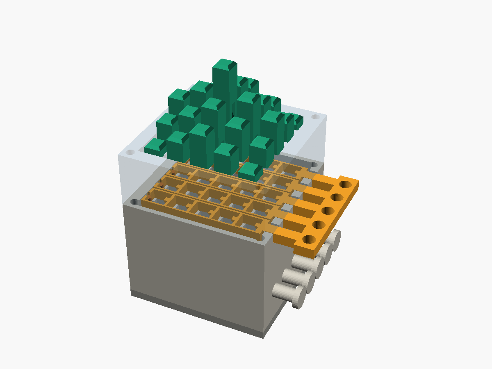
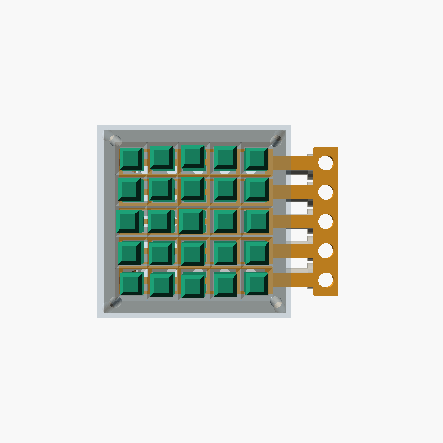
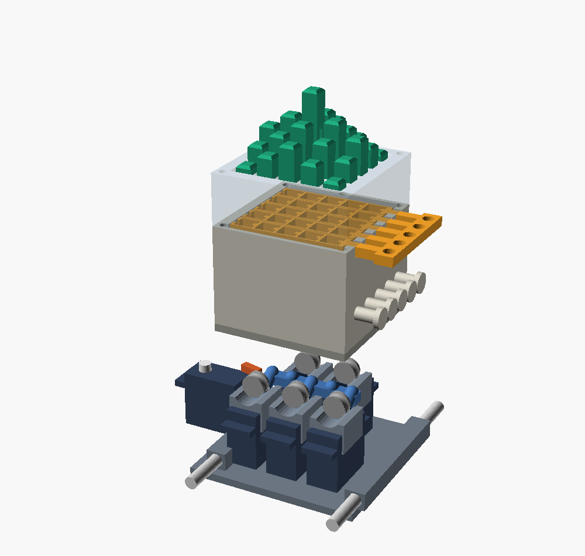
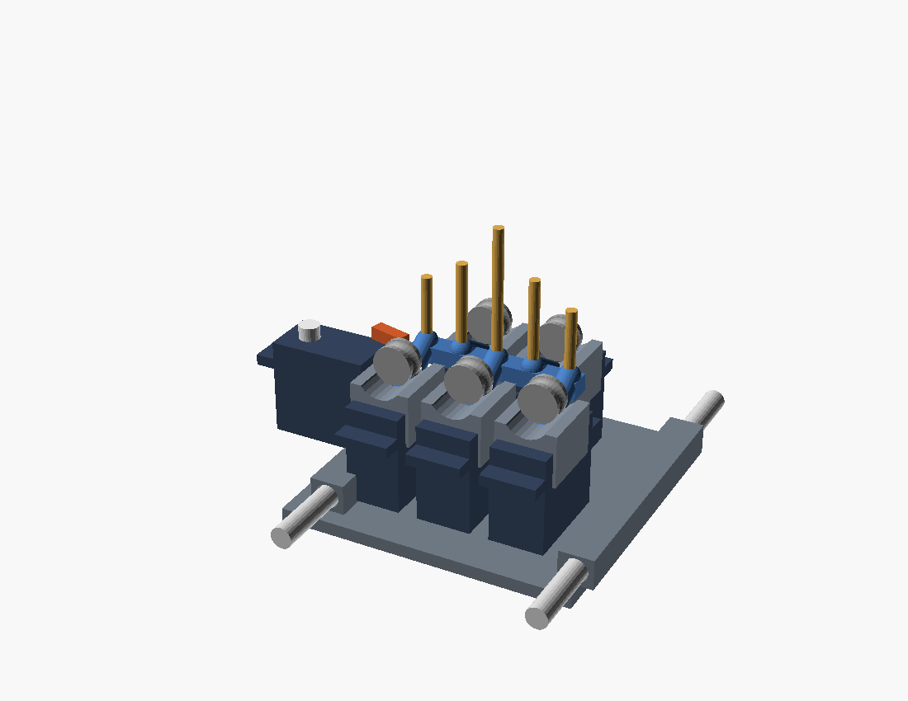

# Trial 7 — sliding-release grid (5×5), capped pins

Carries over trial 6's three-layer "sandwich" detent — it works well, so most
of the geometry is reused unchanged. Two display-side changes plus the start of
the under-display **caddy** are the point of this trial:

1. **Capped pins.** The rack groove now stops below the top, leaving a clean
   solid square cap (~14 mm) as the visible display surface — no groove notch on
   top any more.
2. **A real grid.** Parametric `n_cols × n_rows`, default **5×5**, instead of the
   1×5 test strip. One independent release comb **per row** (so camming a pin in
   one row can't momentarily unlock its neighbours), tiled at the row pitch.
3. **An under-display caddy.** A low cart that rides *under* the display on a
   Y-rail, raises a whole row of pins with flexible push-rods, and trips the
   spring-held lock from below — see **Caddy / actuation** below.

The display stack is in `grid.scad`; the caddy is in `caddy.scad` (which pulls
`grid.scad` in as a library for shared dimensions). Both are vanilla OpenSCAD,
no external libraries. Pick a part with the `part`/`show` variable or `-D`, or
use the pre-exported STLs in `stl/`. `section.scad` renders a cut-open display
row for inspection.

## How the detent works (unchanged from trial 6)

Pins carry a recessed sawtooth rack inside a groove on one face. Blade tongues
on each row's release comb reach into the groove:

- **push a pin up** → the ramps cam the comb sideways against its return band,
  then it snaps back → *click*, one level (5 mm) gained, held.
- **load pushed down** → the flat tooth face presses on the blade top → *locked*.
- **slide the comb 1 mm** → the blades clear every tooth in that row → all pins
  in the row drop to the floor plate.

## Key dimensions (defaults)

| parameter        | value | meaning                                   |
|------------------|-------|-------------------------------------------|
| n_cols × n_rows  | 5×5   | grid size (parametric)                    |
| pitch            | 8.5   | pin pitch (3 per 1-inch D&D square)       |
| pin_w            | 6.0   | square pin width                          |
| travel / levels  | 30/6  | 5 mm per elevation level                  |
| cap_h (derived)  | 14.2  | solid pin cap kept above the rack         |
| release_travel   | 1.0   | comb slide to release a row               |
| engagement       | 0.7   | blade overlap over the tooth tips         |
| rail_t (derived) | 0.65  | row-rail thickness (auto from pitch)      |

### Note on multi-row packing
At `pitch = 8.5` the five row combs tile the top almost edge-to-edge, so the row
rails come out thin (`rail_t ≈ 0.65 mm`, vs 1.5 mm on the trial-6 strip). The
*column bridges* between pins (1.0 mm, loaded in the cam direction) carry the
real load, so this is workable in PETG, but if the combs feel floppy, bump
`pitch` to ~10 mm and `rail_t` climbs back to trial-6 territory (at the cost of
D&D density). Everything is parametric.

## Printing

Display stack (`grid.scad`):

| part           | qty | orientation              | notes                          |
|----------------|-----|--------------------------|--------------------------------|
| pin            | 25  | lying down, groove up    | `pins_print` lays out a batch  |
| grid_bottom    | 1   | as exported              | 3+ perimeters                  |
| release_strip  | 5   | flat                     | PETG preferred (cam wear)      |
| grid_top       | 1   | as exported              |                                |
| floor_plate    | 1   | flat                     |                                |
| release_dowel  | 5   | vertical, or use 2 mm rod| hangs from each comb (release) |
| push_rod       | 1   | vertical, or 3.5 mm rod  | hand-test tool                 |

Caddy (`caddy.scad`, printable parts):

| part              | qty | notes                                            |
|-------------------|-----|--------------------------------------------------|
| caddy_tube_block  | 1   | 5 guide tubes, rank → row fan-in                 |
| caddy_feeder_print| 5   | feeder block (hobbed wheel + sprung idler added) |
| caddy_base_print  | 1   | base plate + linear-bearing bushings             |

Plus hardware: 5 feed micro-servos + 1 release micro-servo (SG90/FS90R class),
2 Y guide rods + bushings, ~1.75–3 mm filament for the push-rods, rubber bands.

PETG recommended throughout; PLA works for the grids. 0.2 mm layers.

## Assembly

1. Bolt `floor_plate` under `grid_bottom` (4× M3).
2. Drop the five `release_strip` combs into the tray, stems out through the east
   slots, one per row.
3. Bolt `grid_top` on (same M3 bolts).
4. Loop a rubber band from each stem paddle around that row's east-wall peg. The
   band pulls the comb west = engaged.
5. Pull a stem (released) and drop that row's pins in from the top, groove facing
   east toward the blades. Let go of the stem.

## Caddy / actuation

A low cart rides under the floor plate on a Y-rail and sets one **row** at a
time, stepping through the five rows. Per-column **flexible push-rods** (1.75–3 mm
filament) are the heart of it.

### Why flexible rods (the kinematics)
To raise a pin to level *k* the rod tip must reach the pin's bottom, which
*climbs* 5 mm per level — up to ~30 mm at the top. So whatever pushes has to be
able to reach 30 mm above the floor. A rigid rod/rack/lead-screw that retracts
between rows must therefore live in ~30 mm of vertical room (hanging below the
caddy or sticking up) — *not* low. A **flexible rod stored horizontal and fed
vertical** needs almost no vertical storage: only the *fed* length is upright.
That is exactly Sander's instinct, and it's the right call for a low caddy.

The pin's own detent holds every click, so the feeder only nudges the rod a
little at a time ("pump") and the rod follows the pin up. Between rows the tips
retract below the floor and the caddy steps in Y.

### Fanning out the servos
Five servos can't sit at the 8.5 mm pitch. They **stand in two ranks**
(front/back); each is only 12.6 mm wide, so alternate columns clear, and the
guide tubes fan in Y from the ranks to the row centre line. Cost: the caddy
footprint is ~3× the grid in Y (the servos sprawl front and back). Caddy height
is ~one standing servo (~30 mm) — the low dimension we cared about.

### Releasing the lock from below
Each row comb carries a **release dowel** (`release_dowel`, or a 2 mm rod) that
drops through slots in the guide and floor plate to the caddy plane. A
micro-servo **release finger** on the caddy nudges the parked row's dowel ~1 mm
east to disengage that row; the band snaps it back. Sweeping all five rows
clears the board.

### How a frame is drawn
1. Sweep the rows, tripping each release dowel → every pin drops to the floor.
2. For each row: park under it, feed each column's rod up to its target level
   (the detent clicks and holds), then retract the tips and step to the next row.
3. To change the picture, go back to step 1.

### Status & the main risk
This is the **first printable iteration**: chassis, tube block, 2-rank servo
layout, rod routing and release finger are modelled; the feeder internals
(hobbed wheel + sprung idler, like a printer extruder) are schematic and expect
physical tuning. The **key risk is rod buckling**: above the floor the fed rod
is only loosely guided by the pin channel, so at the highest levels a thin rod
may bow. Mitigations to test: a stiffer rod (PETG/nylon, 2.5–3 mm), letting the
6.6 mm channel act as a buckling restraint, or capping practical travel at ~4–5
levels. If buckling proves limiting, the rigid-chain ("zip-lift") variant is the
fallback — it stores flat too but can't buckle.

Views: `show = assembly | section | exploded | caddy | tube_block | feeder |
release | base` (e.g. `openscad -D 'show="exploded"' caddy.scad`).
