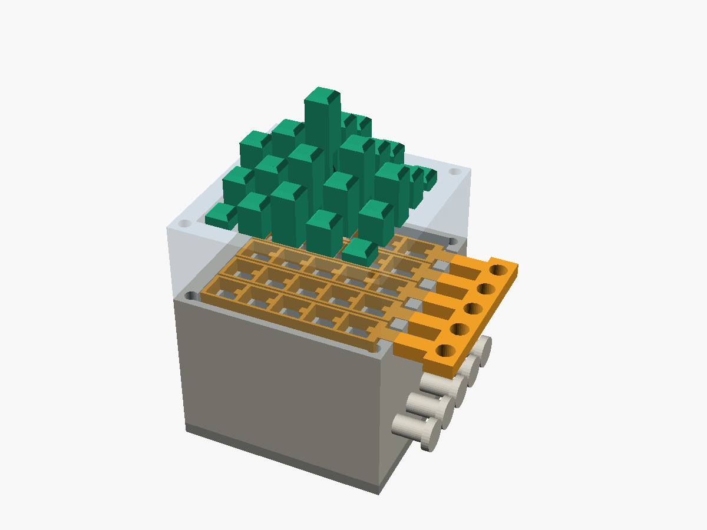
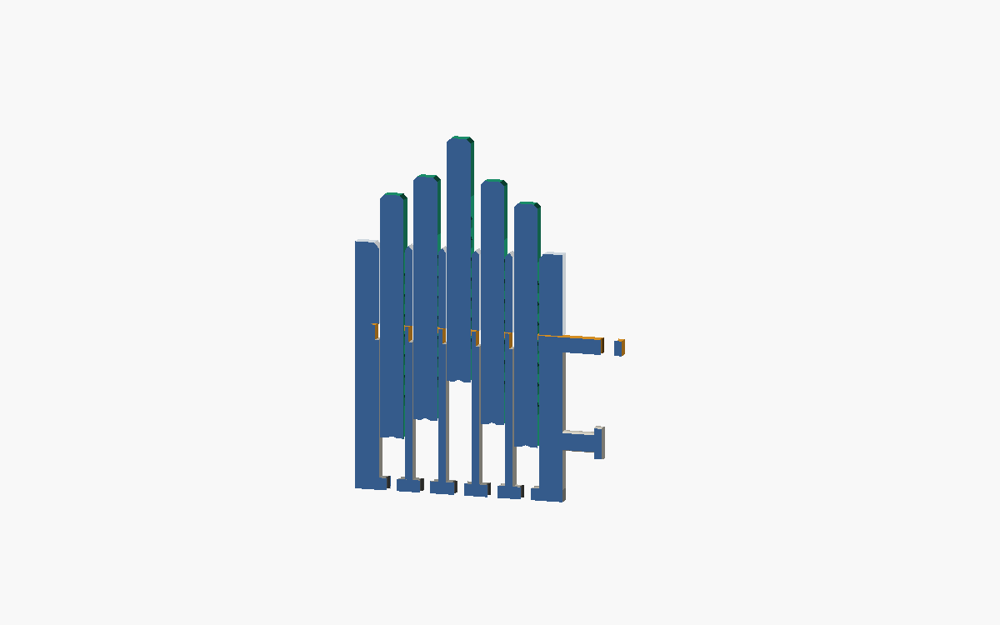

# Trial 7 — sliding-release grid (5×5), capped pins

Carries over trial 6's three-layer "sandwich" detent — it works well, so most
of the geometry is reused unchanged. Two display-side changes plus the start of
the under-display **caddy** are the point of this trial:

1. **Capped pins.** The rack groove now stops below the top, leaving a clean
   solid square cap (~14 mm) as the visible display surface — no groove notch on
   top any more.
2. **A real grid.** Parametric `n_cols × n_rows`, default **5×5**, instead of the
   1×5 test strip. One independent release comb **per row** (so camming a pin in
   one row can't momentarily unlock its neighbours), tiled at the row pitch.
3. **Caddy actuation (in progress).** A cart that rides *under* the display,
   carries the push-rod lift(s), and trips the spring-held lock from below. The
   mechanism is being chosen — see **Caddy / actuation** below.

Everything in the display stack is in `grid.scad` (vanilla OpenSCAD, no
libraries). Pick the part with the `part` variable or `-D 'part="..."'`, or use
the pre-exported STLs in `stl/`. `section.scad` renders a cut-open row for
inspection (render it with `-D 'part="none"'` so only the slice shows).

## How the detent works (unchanged from trial 6)

Pins carry a recessed sawtooth rack inside a groove on one face. Blade tongues
on each row's release comb reach into the groove:

- **push a pin up** → the ramps cam the comb sideways against its return band,
  then it snaps back → *click*, one level (5 mm) gained, held.
- **load pushed down** → the flat tooth face presses on the blade top → *locked*.
- **slide the comb 1 mm** → the blades clear every tooth in that row → all pins
  in the row drop to the floor plate.

## Key dimensions (defaults)

| parameter        | value | meaning                                   |
|------------------|-------|-------------------------------------------|
| n_cols × n_rows  | 5×5   | grid size (parametric)                    |
| pitch            | 8.5   | pin pitch (3 per 1-inch D&D square)       |
| pin_w            | 6.0   | square pin width                          |
| travel / levels  | 30/6  | 5 mm per elevation level                  |
| cap_h (derived)  | 14.2  | solid pin cap kept above the rack         |
| release_travel   | 1.0   | comb slide to release a row               |
| engagement       | 0.7   | blade overlap over the tooth tips         |
| rail_t (derived) | 0.65  | row-rail thickness (auto from pitch)      |

### Note on multi-row packing
At `pitch = 8.5` the five row combs tile the top almost edge-to-edge, so the row
rails come out thin (`rail_t ≈ 0.65 mm`, vs 1.5 mm on the trial-6 strip). The
*column bridges* between pins (1.0 mm, loaded in the cam direction) carry the
real load, so this is workable in PETG, but if the combs feel floppy, bump
`pitch` to ~10 mm and `rail_t` climbs back to trial-6 territory (at the cost of
D&D density). Everything is parametric.

## Printing

| part           | qty | orientation              | notes                          |
|----------------|-----|--------------------------|--------------------------------|
| pin            | 25  | lying down, groove up    | `pins_print` lays out a batch  |
| grid_bottom    | 1   | as exported              | 3+ perimeters                  |
| release_strip  | 5   | flat                     | PETG preferred (cam wear)      |
| grid_top       | 1   | as exported              |                                |
| floor_plate    | 1   | flat                     |                                |
| push_rod       | 1   | vertical, or 3.5 mm rod  | hand-test tool                 |

PETG recommended throughout; PLA works for the grids. 0.2 mm layers.

## Assembly

1. Bolt `floor_plate` under `grid_bottom` (4× M3).
2. Drop the five `release_strip` combs into the tray, stems out through the east
   slots, one per row.
3. Bolt `grid_top` on (same M3 bolts).
4. Loop a rubber band from each stem paddle around that row's east-wall peg. The
   band pulls the comb west = engaged.
5. Pull a stem (released) and drop that row's pins in from the top, groove facing
   east toward the blades. Let go of the stem.

## Caddy / actuation

The goal: a low cart that rides under the floor plate, raises each pin to its
target height, and trips the spring-held lock — all from below. **The actuation
approach is the open design decision for this trial** (see the project chat).
The leading idea exploits the ratchet: because each click is *held*, a push rod
only needs ~one-tooth (~7 mm) of stroke and can "pump" a pin up level by level,
which keeps the caddy very low. The per-row release is tripped from below by a
small finger on the caddy nudging a depending post on each comb ~1 mm.

Once chosen, the caddy parts land in this folder alongside the display stack.
